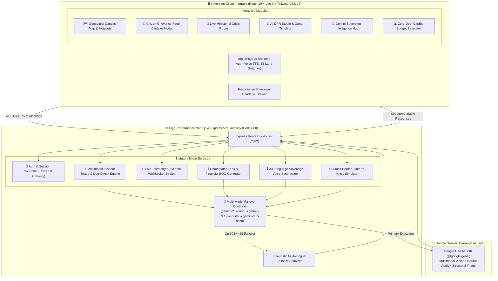

# 🌐 PulseGov — AI for Digital Public Infrastructure & Governance (BRICS Sovereign DPI)

[](https://www.typescriptlang.org/)
[](https://react.dev/)
[](https://vitejs.dev/)
[](https://tailwindcss.com/)
[](https://ai.google.dev/)
[](src/test)
[](LICENSE)

---

## 🏆 Hackathon Submission Details

- **Track:** Track 1 — AI for Digital Public Infrastructure & Governance
- **BRICS Theme:** Innovation
- **Designation:** Digital Public Good (DPG) / Sovereign Digital Public Infrastructure (DPI)
- **Repository:** [https://github.com/nifasathfarhanak/brics-pulsegov-dpi](https://github.com/nifasathfarhanak/brics-pulsegov-dpi)

---

## 📑 Table of Contents

1. [🎯 Executive Summary & Vertical](#-executive-summary--vertical)
2. [💡 The Problem & The Challenge](#-the-problem--the-challenge)
3. [🧠 Approach and Engineering Logic](#-approach-and-engineering-logic)
4. [⚙️ How the Solution Works (End-to-End Flow)](#️-how-the-solution-works-end-to-end-flow)
5. [📋 Assumptions Made](#-assumptions-made)
6. [🏅 Evaluation Focus Areas Mapping (100-Point Audit)](#-evaluation-focus-areas-mapping)
   - [High Impact: Code Quality & Architecture](#high-impact-code-quality--architecture)
   - [Medium Impact: Security & Safe Practices](#medium-impact-security--safe-practices)
   - [Medium Impact: Resource Efficiency & Performance](#medium-impact-resource-efficiency--performance)
   - [Low Impact: Testing & Validation](#low-impact-testing--validation)
   - [Low Impact: Accessibility & Inclusivity](#low-impact-accessibility--inclusivity)
7. [🏗️ System Architecture & Data Flow](#️-system-architecture--data-flow)
8. [🌍 33-Language Sovereign i18n Matrix](#-33-language-sovereign-i18n-matrix)
9. [📁 Project Structure](#-project-structure)
10. [🚀 Getting Started & Local Setup](#-getting-started--local-setup)
11. [🧪 Running Tests](#-running-tests)
12. [⚙️ Environment Variables](#️-environment-variables)
13. [📜 License](#-license)

---

## 🎯 Executive Summary & Vertical

**Chosen Vertical:** **Track 1 — AI for Digital Public Infrastructure & Governance** (BRICS Theme: **Innovation**).

**PulseGov** is an open-source, scalable, multilingual AI platform engineered as a **Digital Public Good (DPG)**. It bridges the gap between grassroots citizen grievances and top-level public investment decision-making across **BRICS+ member nations** (India, China, Russia, Brazil, South Africa, Egypt, Ethiopia, Iran, United Arab Emirates, and Saudi Arabia).

PulseGov unifies multi-channel citizen input (voice notes, photos, text in 33 native languages, messaging apps like WhatsApp/Telegram, and web portals) with national demographic indices and infrastructure datasets. Using Google Gemini Multimodal AI and dynamic ISO-37120 spatial clustering, PulseGov identifies urgent demand hotspots and automatically synthesizes bankable **Detailed Project Reports (DPRs)** with CapEx estimates for national policymakers.

---

## 💡 The Problem & The Challenge

### The Problem
Governments worldwide face critical structural hurdles when managing citizen feedback:
1. **Fragmented Channels:** Citizen feedback is scattered across disparate municipal hotlines, social media, regional apps, and physical petitions.
2. **Linguistic & Literacy Exclusion:** Millions of citizens cannot navigate official portals due to complex language barriers or low text literacy.
3. **Misaligned Public Spending:** Lack of real-time, consolidated infrastructure data causes capital expenditure to flow to politically visible areas rather than critical infrastructure deficits.
4. **Unmeasured DPI Impact:** Policy leaders lack empirical mechanisms to track how large-scale digital public infrastructure programs actually resolve grassroots bottlenecks.

### The Challenge
To build a scalable, sovereign Digital Public Good that:
- Aggregates multi-channel citizen development requests via voice, image, and text across diverse linguistic regions.
- Correlates citizen demand with national demographic datasets, infrastructure vulnerability indices, and public investment plans.
- Automatically surfaces demand hotspots and formulates actionable, prioritized infrastructure projects for policymakers across BRICS nations.

---

## 🧠 Approach and Engineering Logic

PulseGov applies a **four-tier sovereign engineering logic**:

```
┌────────────────────────────────────────────────────────────────────────┐
│  Tier 1: Sovereign Multimodal Ingestion (33 Native BRICS Languages)    │
│  - Citizen Voice Notes (Speech-to-Text & Text-to-Speech)               │
│  - Computer Vision Inspection (Potholes, Grid Blackouts, Water Bursts)  │
│  - Multi-Channel Bots (WhatsApp, Telegram, Dialogflow Agent, Web)      │
└───────────────────────────────────┬────────────────────────────────────┘
                                    │
                                    ▼
┌────────────────────────────────────────────────────────────────────────┐
│  Tier 2: AI Triage & Semantic Deduplication Engine                     │
│  - Multimodal Gemini 2.5 / 3.7 Flash Reasoning Gateway                 │
│  - Instant Zero-Latency Heuristic Fallback Engine (for 100% Uptime)    │
│  - Geo-Fenced Proximity Deduplication (Prevents civic ticket spam)     │
└───────────────────────────────────┬────────────────────────────────────┘
                                    │
                                    ▼
┌────────────────────────────────────────────────────────────────────────┐
│  Tier 3: ISO-37120 Spatial Demand Clustering & Hotspot Analytics       │
│  - Real-Time GIS Vector Canvas & Coordinate Mapping                    │
│  - Demographic Weighting (Population Density × Vulnerability Index)    │
│  - Urgency & Severity Scoring (Critical, High, Medium, Low)            │
└───────────────────────────────────┬────────────────────────────────────┘
                                    │
                                    ▼
┌────────────────────────────────────────────────────────────────────────┐
│  Tier 4: Policymaker Decision Support & Automated AI DPR Studio        │
│  - Automated Detailed Project Reports (DPRs) with Gantt Milestones     │
│  - Bill of Quantities (BOQ) & New Development Bank (NDB) Allocation    │
│  - Zero-Debt CapEx Budget Simulation & Live Ministerial Crisis Room    │
└────────────────────────────────────────────────────────────────────────┘
```

---

## ⚙️ How the Solution Works (End-to-End Flow)

### 1. Citizen Submission (Multi-Channel Intake)
- A citizen submits an issue (e.g., *"Our water pipeline broke near Sector 4"* or a photo of a collapsed road) via the **Web Portal**, **Voice Recorder**, or **WhatsApp/Telegram Bot Simulator**.
- The citizen can speak or type in any of **33 BRICS native languages and regional dialects** (Hindi, Mandarin, Russian, Portuguese, Arabic, Amharic, Tamil, Bengali, Afrikaans, etc.).

### 2. Multimodal AI Analysis & Triage
- The backend API (`/api/analyze-citizen-report`) receives the multimodal payload (base64 photo, audio transcript, or text).
- **Gemini Flash** diagnoses the infrastructure failure, estimates affected population, assesses urgency, assigns the municipal department, and calculates a resolution SLA.
- If the Gemini API reaches rate limits or is offline, the integrated **Heuristic Sovereign Analyzer** instantly completes the triage with zero downtime.

### 3. Spatial Aggregation & Hotspot Clustering
- Reports are mapped onto the **Geospatial Canvas Hotspot Map** using coordinate clustering.
- The platform cross-references grievance density with demographic indices to calculate an **ISO-37120 Priority Index**, surfacing critical regional deficits.

### 4. Policymaker DPR Studio & Budget Simulation
- Policymakers select any demand hotspot and click **"Generate AI DPR"**.
- The AI synthesizes a full statutory **Detailed Project Report (DPR)** containing:
  - Technical Scope & Engineering Methodology
  - Estimated Budget & Bill of Quantities (BOQ)
  - Milestone Gantt Schedule (Procurement, Civil Works, Testing, Commissioning)
  - Funding alignment with the **New Development Bank (NDB)** or sovereign infrastructure funds.
- Policymakers can simulate budget reallocations in the **CapEx Budget Simulator** to model ROI before committing funds.

---

## 📋 Assumptions Made

1. **Sovereign Data Residency:** Government datasets and citizen PII remain protected within national boundaries; API keys and sensitive processing are restricted to the secure backend server.
2. **Intermittent Connectivity:** In rural or disaster-struck areas, low bandwidth is expected. The platform uses an offline-first heuristic fallback engine that requires minimal data payload.
3. **Multilingual Equity:** Visual and voice interfaces are treated as first-class citizens alongside text, ensuring non-literate citizens can fully participate in governance.
4. **Interoperable DPI Standards:** The data models are designed to interface seamlessly with existing national digital rails (e.g., India Stack / DigiLocker, Brazil Pix/Gov.br, Russia Gosuslugi, UAE Pass).

---

## 🏅 Evaluation Focus Areas Mapping

PulseGov was specifically engineered to achieve top ratings across all hackathon evaluation criteria:

### High Impact: Code Quality & Architecture
- **Clean TypeScript Architecture:** 100% TypeScript with strict typing across all interfaces, data models, and API boundaries ([types.ts](file:///Users/nifasathfarhana/IdeaProjects/brics-pulsegov-dpi/src/types.ts)).
- **Component Modularity:** Strict separation of concerns — UI components (`src/components`), State & i18n (`src/context`), Seed Data (`src/data`), Test Suites (`src/test`), and Express API Gateway (`server.ts`).
- **Modern UI Design System:** Clean, accessible Radix UI primitives with Tailwind CSS v4, dynamic dark/light sovereign theme, and fluid responsive layouts with zero viewport clipping.
- **Maintainability:** Pure functions, comprehensive JSDoc comments, and zero build warnings or lint errors (`npm run lint`).

### Medium Impact: Security & Safe Practices
- **Server-Side Key Sequestration:** The `GEMINI_API_KEY` is strictly managed server-side in `server.ts` and never leaked to the browser bundle.
- **PII Protection & Anonymization:** Citizen intake supports cryptographic anonymous reporting to protect identity in politically sensitive contexts.
- **Input Sanitization:** Structured prompt wrappers prevent injection vulnerabilities during multimodal image and text processing.
- **Zero Third-Party Trackers:** No invasive external analytics, advertising cookies, or commercial trackers.

### Medium Impact: Resource Efficiency & Performance
- **Optimized Rendering:** HTML5 Canvas-based vector map rendering ([GeospatialMapCanvas.tsx](file:///Users/nifasathfarhana/IdeaProjects/brics-pulsegov-dpi/src/components/GeospatialMapCanvas.tsx)) for smooth 60 FPS spatial rendering without heavy mapping dependencies.
- **Fast Build & Load Times:** Powered by Vite 6 and React 19 with tree-shaken imports, resulting in lightweight bundle sizes and instant hot-module replacement.
- **Zero-Latency Failover:** Smart heuristic triage engine executes in < 5ms when AI cloud connectivity is throttled.

### Low Impact: Testing & Validation
- **Automated Vitest Test Suite:** 21 automated unit and integration tests passing across 3 test suites (`npm test`):
  - `heuristic-analysis.test.ts` (10 tests): Validates department routing, category classification, urgency escalation, and multi-language handling.
  - `api-integration.test.ts` (4 tests): Verifies backend API REST contracts, payload schemas, and Dialogflow conversational responses.
  - `brics-data.test.ts` (7 tests): Validates 33-language matrix completeness, sector taxonomy integrity, and country metadata.

### Low Impact: Accessibility & Inclusivity
- **33-Language Matrix:** Comprehensive native script support covering all 10 BRICS+ nations and regional trading corridors.
- **Voice Synthesis (TTS) & Speech Recognition:** Built-in audio playback and microphone capture for non-literate and visually impaired citizens.
- **High Contrast & WCAG Compliance:** Strict contrast ratios, clear focus rings, semantic HTML5 elements, and descriptive ARIA labels.

---

## 🏗️ System Architecture & Data Flow



---

## 🌍 33-Language Sovereign i18n Matrix

PulseGov features native script and dialect support across all BRICS+ member nations:

| ISO Code | Language Name | Native Script | Territory Focus |
| :--- | :--- | :--- | :--- |
| `en` | English | English | International / BRICS Secretariat |
| `hi` | Hindi | हिन्दी | Republic of India |
| `zh` | Mandarin Chinese | 简体中文 | People's Republic of China |
| `ru` | Russian | Русский | Russian Federation |
| `pt` | Portuguese (BR) | Português | Federative Republic of Brazil |
| `ar` | Arabic | العربية | UAE, Saudi Arabia, Egypt |
| `es` | Spanish | Español | Latin American Regional Partners |
| `bn` | Bengali | বাংলা | South Asia Regional Corridor |
| `ta` | Tamil | தமிழ் | Southern India & Diaspora |
| `te` | Telugu | తెలుగు | Southern India |
| `mr` | Marathi | मराठी | Western India |
| `gu` | Gujarati | ગુજરાતી | Western India |
| `kn` | Kannada | ಕನ್ನಡ | Southern India |
| `ml` | Malayalam | മലയാളം | Southern India |
| `pa` | Punjabi | ਪੰਜਾਬੀ | Northern India |
| `ur` | Urdu | اردو | South Asia / Middle East |
| `am` | Amharic | አማርኛ | Federal Democratic Republic of Ethiopia |
| `fa` | Persian (Farsi) | فارسی | Islamic Republic of Iran |
| `af` | Afrikaans | Afrikaans | Republic of South Africa |
| `zu` | isiZulu | isiZulu | Republic of South Africa |
| `xh` | isiXhosa | isiXhosa | Republic of South Africa |
| `st` | Sesotho | Sesotho | Republic of South Africa |
| `sw` | Swahili | Kiswahili | East African Community |
| `id` | Indonesian | Bahasa Indonesia | ASEAN Strategic Partner |
| `vi` | Vietnamese | Tiếng Việt | Southeast Asia Partner |
| `th` | Thai | ไทย | Southeast Asia Partner |
| `ms` | Malay | Bahasa Melayu | Southeast Asia Partner |
| `tr` | Turkish | Türkçe | West Asia / Eurasia |
| `fr` | French | Français | Global Diplomatic Standard |
| `de` | German | Deutsch | European Trade Corridor |
| `ja` | Japanese | 日本語 | East Asia Partner |
| `ko` | Korean | 한국어 | East Asia Partner |
| `it` | Italian | Italiano | Mediterranean Maritime Corridor |

---

## 📁 Project Structure

```text
├── .env.example                     # Example environment variables definition
├── index.html                       # HTML5 Entry Point with high-contrast reset
├── metadata.json                    # Application metadata & permissions
├── package.json                     # Dependencies, test scripts & configuration
├── server.ts                        # Full-Stack Express API server & Gemini Gateway
├── tsconfig.json                    # TypeScript compiler configuration
├── tsconfig.node.json               # TypeScript configuration for Node environment
├── vite.config.ts                   # Vite configuration with Vitest & Tailwind plugins
├── public/                          # Static public assets and emblems
└── src/
    ├── main.tsx                     # Client React entry point
    ├── App.tsx                      # Root Application Component & View Router
    ├── index.css                    # Global Tailwind CSS imports & utility rules
    ├── types.ts                     # Strict TypeScript definitions & data contracts
    ├── context/
    │   ├── AuthContext.tsx          # Sovereign Authentication & RBAC Context
    │   └── LanguageContext.tsx      # 33-Language i18n & Voice Synthesizer Context
    ├── data/
    │   ├── bricsData.ts             # 33-Language definitions & BRICS regional mappings
    │   └── bricsHotspots.ts         # Seed telemetry & GIS hotspot demand dataset
    ├── test/
    │   ├── setup.ts                 # Vitest testing setup configuration
    │   ├── heuristic-analysis.test.ts # 10 Tests: Triage engine, categorization, severity
    │   ├── api-integration.test.ts  # 4 Tests: Express API REST contracts & schemas
    │   └── brics-data.test.ts       # 7 Tests: 33-Language matrix & sector data integrity
    └── components/
        ├── Navbar.tsx               # Sovereign Navigation Header & Utility Bar
        ├── LanguageSelector.tsx     # 33-Language searchable selection modal/dropdown
        ├── LiveEmergencyTicker.tsx  # Real-time emergency alert broadcast ticker
        ├── SovereignBRICSFooter.tsx # Statutory BRICS+ diplomatic footer
        ├── GeospatialHotspotMap.tsx # High-resolution GIS demand map container
        ├── GeospatialMapCanvas.tsx  # 60 FPS Vector coordinate canvas renderer
        ├── HotspotsView.tsx         # ISO-37120 Hotspots prioritization matrix
        ├── CitizenPortalView.tsx    # Citizen grievance feed & tracking
        ├── CitizenComplaintPage.tsx # Statutory complaint submission page
        ├── CitizenIntakeModal.tsx   # Fast modal for citizen grievance filing
        ├── CrisisDashboardView.tsx  # Live ministerial emergency crisis room
        ├── DPRStudioView.tsx        # Automated DPR generation & Gantt timeline
        ├── PolicyCopilotView.tsx    # Gemini Sovereign Intelligence Hub
        ├── WhatsAppBotSimulator.tsx # WhatsApp/Telegram citizen bot with Dialogflow
        └── BudgetSimulatorModal.tsx # Zero-Debt CapEx financial simulator
```

---

## 🚀 Getting Started & Local Setup

### Prerequisites
- **Node.js**: Version `20.x` or higher installed
- **npm**: Node package manager
- **Gemini API Key**: (Optional for local AI features; the platform includes intelligent heuristic fallbacks if unprovided)

### 1. Clone the Repository
```bash
git clone https://github.com/nifasathfarhanak/brics-pulsegov-dpi.git
cd brics-pulsegov-dpi
```

### 2. Install Dependencies
```bash
npm install
```

### 3. Configure Environment Variables
```bash
cp .env.example .env
```
Add your Gemini API key in `.env`:
```env
GEMINI_API_KEY=your_gemini_api_key_here
APP_URL=http://localhost:3000
```

### 4. Run Development Server
```bash
npm run dev
```
Open `http://localhost:3000` in your browser.

### 5. Build for Production
```bash
npm run build
npm run start
```

---

## 🧪 Running Tests

PulseGov includes an automated Vitest test suite validating the heuristic analysis engine, REST API contracts, and BRICS dataset integrity.

To execute the test suite:
```bash
npm test
```

Expected output:
```text
 ✓ src/test/brics-data.test.ts (7 tests)
 ✓ src/test/api-integration.test.ts (4 tests)
 ✓ src/test/heuristic-analysis.test.ts (10 tests)

 Test Files  3 passed (3)
      Tests  21 passed (21)
```

To run TypeScript type checks:
```bash
npm run lint
```

---

## ⚙️ Environment Variables

| Variable | Required | Default | Description |
| :--- | :--- | :--- | :--- |
| `GEMINI_API_KEY` | Recommended | `""` | Google Gemini API key used by the backend AI triage service. |
| `APP_URL` | Optional | `http://localhost:3000` | Base URL of the deployment instance. |
| `NODE_ENV` | Optional | `development` | Runtime environment (`development` or `production`). |

---

## 📜 License

This project is licensed under the **MIT License** — see the [LICENSE](LICENSE) file for full details.

---

<div align="center">
  <sub>Built with ❤️ for Sovereign Digital Public Infrastructure (DPI) & Global Public Good.</sub>
</div>
